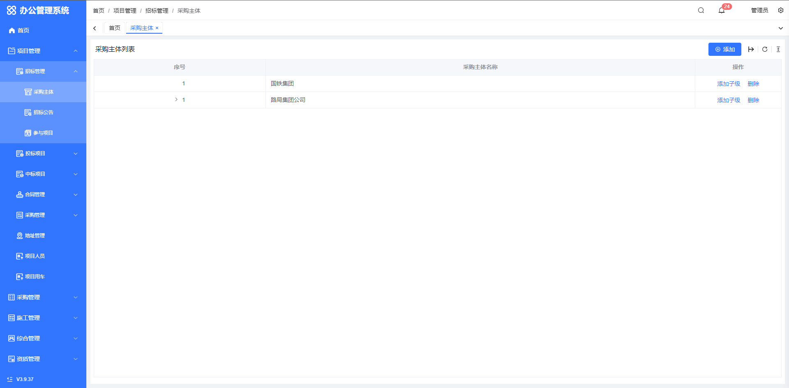
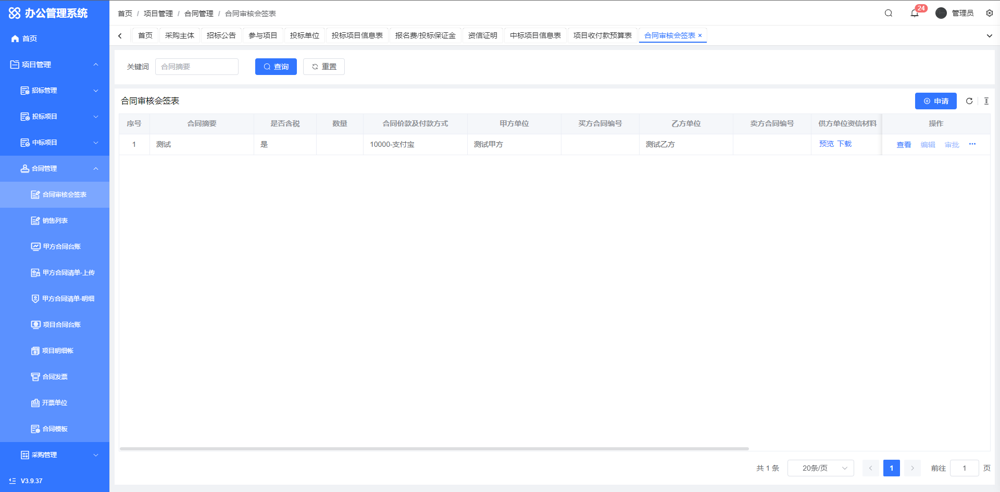
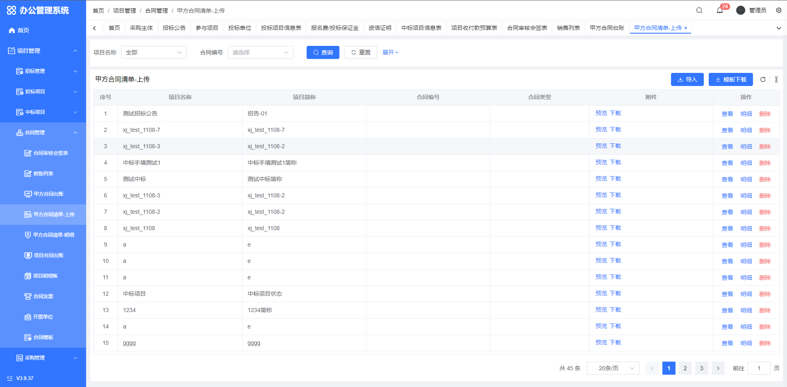

<h1>OA办公管理系统</h1>


[](https://gitee.com/suzhou-youjie/oa/stargazers)[](https://gitee.com/suzhou-youjie/oa/members)

## 一、系统简介[](https://gitee.com/suzhou-youjie/oa)

`OA` 是一款基于开源免费且开箱即用的 vue-pure-admin 中后台管理系统模版进行二次开发的办公管理系统。使用了最新的 `Vue3`、`Vite`、`Element-Plus`、`TypeScript`、`Pinia`、`Tailwindcss` 等主流技术开发

## 二、功能模块

- [首页看板](#首页)
- [项目管理](#项目管理)
  - [招标管理](#招标管理)
    - [采购主体](#采购主体)
    - [采购主体](#招标公告)
    - [参与项目](#参与项目)
  - [投标管理](#投标管理)
    - [投标单位](#投标单位)
    - [招标项目信息表](#招标项目信息表)
    - [报名费/投标保证金](#报名费/投标保证金)
    - [资信证明](#资信证明)
  - [中标项目](#中标项目)
    - [中标项目信息表](#中标项目信息表)
    - [项目收付款预算表](#项目收付款预算表)
  - [合同管理](#合同管理)
    - [合同审核会签表](#合同审核会签表)
    - [销售列表](#销售列表)
    - [甲方合同台账](#甲方合同台账)
    - [甲方合同清单-上传](#甲方合同清单-上传)
    - [甲方合同清单-明细](#甲方合同清单-明细)
    - [项目合同台账](#项目合同台账)
    - [项目明细账](#项目明细账)
    - [合同发票](#合同发票)
    - [开票单位](#开票单位)
    - [合同模板](#合同模板)
  - [采购管理](#采购管理)
    - [下采单](#下采单)
    - [我的下采单](#我的下采单)
    - [下采单审核](#下采单审核)
  - [地址管理](#地址管理)
  - [项目人员](#项目人员)
  - [项目用车](#项目用车)
- [采购管理](#采购管理)
  - [待领采购单](#待领采购单)
  - [我的待采单](#我的待采单)
  - [合同审批会签表](#合同审批会签表)
  - [发货签收单](#发货签收单)
  - [入库单](#入库单)
  - [出库单](#出库单)
  - [付款流程](#付款流程)
  - [项目明细台账](#项目明细台账)
  - [购销存明细](#购销存明细)
  - [采购附件](#采购附件)
  - [历史价格](#历史价格)
  - [供应商管理](#供应商管理)
  - [供应商列表](#供应商列表)
  - [采购会签申请](#采购会签申请)
- [施工管理](#施工管理)
- [综合管理](#综合管理)
  - [员工列表](#员工列表)
  - [文件审批](#文件审批)
    - [人员需求审批](#人员需求审批)
    - [面试评价与录用审批](#面试评价与录用审批)
    - [试用期转正审批](#试用期转正审批)
    - [员工辞职审批](#员工辞职审批)
    - [签订劳动合同审批单](#签订劳动合同审批单)
    - [离职会签单](#离职会签单)
  - [劳动合同管理](#劳动合同管理)
  - [通讯录](#通讯录)
  - [通知公告](#通知公告)
  - [工作待办](#工作待办)
  - [公告发布](#公告发布)
  - [系统通知](#系统通知)
- [资质管理](#资质管理)
  - [企业资质](#企业资质)
  - [个人资质](#个人资质)
- [借阅管理](#借阅管理)
  - [印章借阅](#印章借阅)
  - [原件借阅](#原件借阅)
  - [备用金/专项资金](#备用金/专项资金)
- [报销管理](#报销管理)
  - [日常费用](#日常费用)
  - [非日常费用](#非日常费用)
  - [费用报销](#费用报销)
- [考勤管理](#考勤管理)

  - [考勤组](#考勤组)
  - [请假管理](#请假管理)
  - [外出管理](#外出管理)
  - [出差管理](#出差管理)
  - [加班管理](#加班管理)
  - [补卡管理](#补卡管理)
  - [外勤管理](#外勤管理)
  - [考勤明细](#考勤明细)
  - [考勤统计](#考勤统计)
  - [原始打卡记录](#原始打卡记录)
  - [项目出勤审批](#项目出勤审批)
  - [部门考勤登记](#部门考勤登记)
  - [我的考勤](#我的考勤)
    - [考勤统计](#考勤统计)
    - [考勤日历](#考勤日历)
  - [假期管理](#假期管理)
    - [假期规则](#假期规则)
    - [员工假期余额](#员工假期余额)
    - [国假管理](#国假管理)

- [资产管理](#资产管理)
  - [类别管理](#类别管理)
  - [资产列表](#资产列表)
  - [资产审核列表](#资产审核列表)
  - [流转记录](#流转记录)
  - [我的资产](#我的资产)
  - [我的资产申请](#我的资产申请)
  - [报废列表](#报废列表)
  - [采购管理](#采购管理)
    - [采购申请](#采购申请)
  - [计算机设备领用](#计算机设备领用)
    - [计算机设备列表](#计算机设备列表)
    - [计算机设备配件](#计算机设备配件)
    - [计算机设备领用登记](#计算机设备领用登记)
  - [办公设备领用](#办公设备领用)
    - [办公设备列表](#办公设备列表)
    - [办公设备领用登记](#办公设备领用登记)
- [房屋管理](#房屋管理)
  - [房屋列表](#房屋列表)
  - [房间管理](#房间管理)
  - [租赁管理](#租赁管理)
  - [房屋租赁提醒设置](#房屋租赁提醒设置)
- [车辆管理](#车辆管理)
  - [车辆列表](#车辆列表)
  - [保险记录](#保险记录)
  - [保养/维修记录](#保养/维修记录)
  - [违章记录](#违章记录)
  - [用车管理](#用车管理)
  - [驾驶员管理](#驾驶员管理)
  - [车位管理](#车位管理)
- [系统管理](#系统管理)
  - [权限管理](#用户管理)
    - [用户管理](#用户管理)
    - [角色管理](#角色管理)
    - [菜单管理](#菜单管理)
    - [按钮管理](#按钮管理)
  - [配置管理](#配置管理)
  - [组织结构](#部门管理)
    - [部门管理](#部门管理)
    - [职工管理](#职工管理)
    - [岗位管理](#岗位管理)
  - [任务管理](#定时任务)
    - [定时任务](#定时任务)
    - [任务日志](#任务日志)
    - [提醒规则](#提醒规则)
  - [版本管理](#版本管理)
  - [日志管理](#系统日志)
    - [系统日志](#系统日志)
    - [操作日志](#操作日志)
  - [文件管理](#文件管理)
  - [工作流管理](#工作流管理)

## 三、系统演示

- 框架自定义了大量通用组件，大大减少开发工作量，提升系统风格一致性。
- 预览地址：[http://demo.yjkj.ltd:8090/](http://demo.yjkj.ltd:8090/)
- 官方网站：[http://www.yjkj.ltd](http://www.yjkj.ltd)
- 登录账号：demo
- 登录密码：demo1234
- gitee 地址：[https://gitee.com/suzhou-youjie/oa](https://gitee.com/suzhou-youjie/oa)

> [!TIP]
>
> 请勿随意更改登录密码，防止其它人无法正常预览。

## 四、系统截图

- PC 端

  1. 首页<a name="首页"></a>
     
  2. 项目管理<a name="项目管理"></a>
     <a name="采购主体"></a>
     <a name="招标公告"></a>
     <a name="参与项目"></a>
     <a name="投标单位"></a>
     <a name="招标项目信息表"></a>
     <a name="报名费/投标保证金"></a>
     <a name="资信证明"></a>
     <a name="中标项目信息表"></a>
     <a name="项目收付款预算表"></a>
     <a name="合同审核会签表"></a>
     <a name="销售列表"></a>
     <a name="甲方合同台账"></a>
     <a name="甲方合同清单-上传"></a>
     <a name="甲方合同清单-明细"></a>
     <a name="项目合同台账"></a>
     <a name="项目明细账"></a>
     <a name="合同发票"></a>
     <a name="开票单位"></a>
     <a name="合同模板"></a>
     <a name="下采单"></a>
     <a name="我的下采单"></a>
     <a name="下采单审核"></a>
     <a name="地址管理"></a>
     <a name="项目人员"></a>
     <a name="项目用车"></a>
  3. 采购管理<a name="采购管理"></a>
     <a name="待领采购单"></a>
     <a name="我的待采单"></a>
     <a name="合同审批会签表"></a>
     <a name="发货签收单"></a>
     <a name="入库单"></a>
     <a name="出库单"></a>
     <a name="付款流程"></a>
     <a name="项目明细台账"></a>
     <a name="购销存明细"></a>
     <a name="采购附件"></a>
     <a name="历史价格"></a>
     <a name="供应商管理"></a>
     <a name="供应商列表"></a>
     <a name="采购会签申请"></a>
  4. 施工管理<a name="施工管理"></a>
  5. 综合管理<a name="综合管理"></a>
     <a name="员工列表"></a>
     <a name="人员需求审批"></a>
     <a name="面试评价与录用审批"></a>
     <a name="试用期转正审批"></a>
     <a name="员工辞职审批"></a>
     <a name="签订劳动合同审批单"></a>
     <a name="离职会签单"></a>
     <a name="劳动合同管理"></a>
     <a name="通讯录"></a>
     <a name="通知公告"></a>
     <a name="工作待办"></a>
     <a name="公告发布"></a>
     <a name="系统通知"></a>
  6. 资质管理<a name="资质管理"></a>
     <a name="企业资质"></a>
     <a name="个人资质"></a>
  7. 借阅管理<a name="借阅管理"></a>
     <a name="印章借阅"></a>
     <a name="原件借阅"></a>
     <a name="备用金/专项资金"></a>
  8. 报销管理<a name="报销管理"></a>
     <a name="日常费用"></a>
     <a name="非日常费用"></a>
     <a name="费用报销"></a>
  9. 考勤管理<a name="考勤管理"></a>
     <a name="考勤组"></a>
     <a name="请假管理"></a>
     <a name="外出管理"></a>
     <a name="出差管理"></a>
     <a name="加班管理"></a>
     <a name="补卡管理"></a>
     <a name="外勤管理"></a>
     <a name="考勤明细"></a>
     <a name="考勤统计"></a>
     <a name="原始打卡记录"></a>
     <a name="项目出勤审批"></a>
     <a name="部门考勤登记"></a>
     <a name="我的考勤统计"></a>
     <a name="考勤日历"></a>
     <a name="假期规则"></a>
     <a name="员工假期余额"></a>
     <a name="国假管理"></a>
  10. 资产管理<a name="资产管理"></a>
      <a name="类别管理"></a>
      <a name="资产列表"></a>
      <a name="资产审核列表"></a>
      <a name="流转记录"></a>
      <a name="我的资产"></a>
      <a name="我的资产申请"></a>
      <a name="报废列表"></a>
      <a name="采购申请"></a>
      <a name="计算机设备列表"></a>
      <a name="计算机设备配件"></a>
      <a name="计算机设备领用登记"></a>
      <a name="办公设备列表"></a>
      <a name="办公设备领用登记"></a>
  11. 房屋管理<a name="房屋管理"></a>
      <a name="房屋列表"></a>
      <a name="房间管理"></a>
      <a name="租赁管理"></a>
      <a name="房屋租赁提醒设置"></a>
  12. 车辆管理<a name="车辆管理"></a>
      <a name="车辆列表"></a>
      <a name="保险记录"></a>
      <a name="保养/维修记录"></a>
      <a name="违章记录"></a>
      <a name="用车管理"></a>
      <a name="驾驶员管理"></a>
      <a name="车位管理"></a>
  13. 系统管理<a name="系统管理"></a>
      <a name="用户管理"></a>
      <a name="角色管理"></a>
      <a name="菜单管理"></a>
      <a name="按钮管理"></a>
      <a name="配置管理"></a>
      <a name="部门管理"></a>
      <a name="职工管理"></a>
      <a name="岗位管理"></a>
      <a name="定时任务"></a>
      <a name="任务日志"></a>
      <a name="提醒规则"></a>
      <a name="版本管理"></a>
      <a name="系统日志"></a>
      <a name="操作日志"></a>
      <a name="文件管理"></a>
      <a name="工作流管理"></a>

<!-- - 移动端

<p align="center">
  
</p> -->

## 五、安装使用

- 获取项目代码

```bash
git clone https://gitee.com/suzhou-youjie/oa.git
```

- 安装依赖

```bash
cd OA

pnpm install

```

- 运行

```bash
pnpm serve
```

- 打包

```bash
pnpm build
```

## 六、前端部署

部署相关文件位于项目根目录的frontend文件夹，内容如下（可直接点击链接下载）

- <a name="部署包" href="./frontend/dist.zip" >部署包</a>

## 七、后端部署

后端采用.net框架，部署相关文件位于项目根目录的backend文件夹，内容如下（可直接点击链接下载）

- 1-基础服务接口 <a href="./backend/OABfwApi.240320.zip" target="_blank">下载</a>
- 2-业务服务接口 <a href="./backend/OAWebApi.240320.zip" target="_blank">下载</a>
- 3-文件服务接口 <a href="./backend/FileUploadAPI.20240409.zip" target="_blank">下载</a>
- 4-定时任务服务 <a href="./backend/OATaskScheduler.240320.zip" target="_blank">下载</a>
- 5-文件预览服务 <a href="https://pan.baidu.com/s/1swGr1ULTWBlbbS_C_omLjw?pwd=6ddl" target="_blank">下载</a> 安装方式见(https://gitee.com/kekingcn/file-online-preview)
- 6-数据库脚本 <a href="./backend/数据库脚本.240320.zip" target="_blank">下载</a>
- 7-系统部署手册-Windows <a href="./backend/OA办公管理系统部署手册V1.0.0.pdf" target="_blank">下载</a>
- 8-系统部署手册-Linux <a href="./backend/【linux】OA办公管理系统部署手册V1.0.0.pdf" target="_blank">下载</a>

## 八、更新日志

[CHANGELOG](./CHANGELOG.zh_CN.md)

## 九、配套保姆级文档

[点我查看 vue-pure-admin 文档](https://pure-admin.github.io/pure-admin-doc)  
[点我查看 @pureadmin/utils 文档](https://pure-admin-utils.netlify.app)

## 十、如何贡献

非常欢迎您的加入！[提一个 Issue](https://gitee.com/suzhou-youjie/oa/issues/new) 或者[提一个 Pull Request](https://gitee.com/suzhou-youjie/oa/pull/new)

**Pull Request:**

1. Fork 代码!
2. 创建自己的分支: `git checkout -b feat/xxxx`
3. 提交您的修改: `git commit -am 'feat(function): add xxxxx'`
4. 推送您的分支: `git push origin feat/xxxx`
5. 提交`pull request`

## 十一、`Git` 贡献提交规范

- 参考 [vue](https://github.com/vuejs/vue/blob/dev/.github/COMMIT_CONVENTION.md) 规范 ([Angular](https://github.com/conventional-changelog/conventional-changelog/tree/master/packages/conventional-changelog-angular))

  - `feat` 增加新功能
  - `fix` 修复问题/BUG
  - `style` 代码风格相关无影响运行结果的
  - `perf` 优化/性能提升
  - `refactor` 重构
  - `revert` 撤销修改
  - `test` 测试相关
  - `docs` 文档/注释
  - `chore` 依赖更新/脚手架配置修改等
  - `workflow` 工作流改进
  - `ci` 持续集成
  - `types` 类型定义文件更改
  - `wip` 开发中

## 十二、浏览器支持

本地开发推荐使用 `Chrome 80+` 浏览器

支持现代浏览器, 不支持 `IE`

| [](http://godban.github.io/browsers-support-badges/)</br>IE | [](http://godban.github.io/browsers-support-badges/)</br>Edge | [](http://godban.github.io/browsers-support-badges/)</br>Firefox | [](http://godban.github.io/browsers-support-badges/)</br>Chrome | [](http://godban.github.io/browsers-support-badges/)</br>Safari |
| :--------------------------------------------------------------------------------------------------------------------------------------------------------------------------------------------------: | :----------------------------------------------------------------------------------------------------------------------------------------------------------------------------------------------------: | :---------------------------------------------------------------------------------------------------------------------------------------------------------------------------------------------------------------: | :-----------------------------------------------------------------------------------------------------------------------------------------------------------------------------------------------------------: | :-----------------------------------------------------------------------------------------------------------------------------------------------------------------------------------------------------------: |
|                                                                                             not support                                                                                              |                                                                                            last 2 versions                                                                                             |                                                                                                  last 2 versions                                                                                                  |                                                                                                last 2 versions                                                                                                |                                                                                                last 2 versions                                                                                                |

## 十三、维护者

[yindengxu_admin](https://gitee.com/yindengxu_admin)、[WeaponChen](https://gitee.com/WeaponChan)、[ZoeJin](https://gitee.com/zoejin)、[sham_poo7](https://gitee.com/sham-poo7)

## 十四、联系作者

- 微信二维码
  <br/>
  

  > [!TIP]
  >
  > 添加好友时请备注“gitee oa”

## 十五、许可证

[MIT © 2020-present, oa](./LICENSE)

## 十六、`Star`

非常感谢留下星星的好心人，感谢您的支持 :heart:

[](https://gitee.com/suzhou-youjie/oa/stargazers)

## 十七、`Fork`

瞧，那些 `小哥哥` 、`小姐姐` 认真 `学习` 的样子真滴是 `哎呦不错哦` :heart:

[](https://gitee.com/suzhou-youjie/oa/members?ref=master)

## 十八、常见问题

- 1. 问题：浏览器访问服务接口时，页面提示“HTTP 错误 500.19 - Internal Server Error 无法访问请求的页面，因为该页的相关配置数据无效。”
  - 方案：
    - 在IIS 模块下，确认是否有”AspNetCoreModuleV2“，若没有或无法打开的，则重新安装aspnetcore-runtime-8.0.x-win-x64.exe。
    - 如果还有此问题，可能是服务器的IIS需要安装<a href="https://www.iis.net/downloads/microsoft/url-rewrite" target="_blank">URL Rewrite Module</a>，注意：安装Rewrite Module后需重启 **IIS服务** 。
